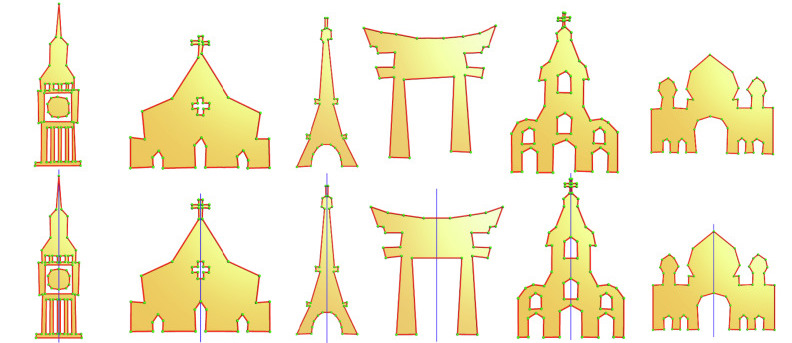

### [Symmetrization of 2D Polygonal Shapes Using Mixed-Integer Programming](https://www.sciencedirect.com/science/article/pii/S0010448523001045)

<p align="center"> 
      
</p>

This repository contains the code and test dataset for the *hypothesize-and-select* based 2D symmetrization method described in the following [paper](https://www.sciencedirect.com/science/article/pii/S0010448523001045):
```latex
Jin Huang, Jantien Stoter, Liangliang Nan.
Symmetrization of 2D Polygonal Shapes Using Mixed-Integer Programming.
Computer-Aided Design, 2023
```


### Obtaining Symmetrization

You can build Symmetrization from the source code˙

* Download the [source code](https://github.com/tudelft3d/Symmetrization).
* Dependencies (Attention for Windows users: ALL dependencies must be for `x64`)
    - [Gurobi](https://www.gurobi.com/). **Note for Linux users:** You may have to build the Gurobi library (`libgurobi_c++.a`)
      because the prebuilt one in the original package might NOT be compatible with your compiler. To do so, go to `src/build`
      and run `make`. Then replace the original `libgurobi_c++.a` (in the `lib` directory) with your generated file.
    - CGAL (v5.4 and later).

* Build

  There are many options to build Symmetrization. Choose one of the following (not an exhaustive list):

    - Option 1 (purely on the command line): Use CMake to generate Makefiles and then `make` (on Linux/macOS) or `nmake`(on Windows with Microsoft
      Visual Studio).
        - On Linux or macOS
            ```
            $ cd path-to-root-dir-of-Symmetrization
            $ mkdir Release
            $ cd Release
            $ cmake -DCMAKE_BUILD_TYPE=Release ..
            $ make
            ```
        - On Windows with Microsoft Visual Studio, use the `x64 Native Tools Command Prompt for VS XXXX` (don't use the x86 one), then
            ```
            $ cd path-to-root-dir-of-Symmetrization
            $ mkdir Release
            $ cd Release
            $ cmake -G "NMake Makefiles" -DCMAKE_BUILD_TYPE=Release ..
            $ nmake
            ```

    - Option 2: Use any IDE that can directly handle CMakeLists files to open the `CMakeLists.txt` in the **root** directory of
      Symmetrization. Then you should have obtained a usable project and just build it. I recommend using
      [CLion](https://www.jetbrains.com/clion/) or [QtCreator](https://www.qt.io/product).
      For Windows users: your IDE must be set for `x64`.

    - Option 3: Use CMake-Gui to generate project files for your favorite IDE. Then load the project to your IDE and build it.
      For Windows users: your IDE must be set for `x64`.

  Don't have any experience with C/C++ programming? Then check this <a href="https://github.com/LiangliangNan/Easy3D/blob/main/HowToBuild.md">How to build</a> I wrote for [Easy3D](https://github.com/LiangliangNan/Easy3D).

### Run Symmetrization


This repository contains an executable program, which is a demo version of our method with a GUI. The program accepts a 2D polygonal shape as input, represented by a .obj file.
  - If the symmetry axis is aligned with Y-axis, press "R" to symmetrize the shape. 
  - If the symmetry axis is arbitrary, press "Q" to symmetrize the shape.
  - If you want to add the horizontal and vertical  constraints,  press "H" to symmetrize the shape.


---

### Data

Some test data can be found [here](./data).


---

### About the solvers
This demo program  use  the commercial solver Gurobi for the [core optimization](./code/method/Optimisation.cpp) step.
To use Gurobi, install it first and make sure  the headers and libraries of Gurobi can be found by CMake. This can be done by specifying the paths of Gurobi in [FindGUROBI.cmake](./code/cmake/FindGUROBI.cmake).
Note: you need to [obtain a license](https://www.gurobi.com/downloads/end-user-license-agreement-academic/) to use Gurobi, which is free for academic use.

---

### Citation
If you use the code/program (or part) of Symmetrization in scientific work, please cite our paper:

```bibtex
@article{huang2023symmetrization,
  title={Symmetrization of 2D Polygonal Shapes Using Mixed-Integer Programming},
  author={Huang, Jin and Stoter, Jantien and Nan, Liangliang},
  journal={Computer-Aided Design},
  pages={103572},
  year={2023},
  publisher={Elsevier}
}
```

---

### License
This program is free software; you can redistribute it and/or modify it under the terms of the GNU General Public License as published by the Free Software Foundation; either version 3 of the License or (at your option) any later version. The full text of the license can be found in the accompanying LICENSE file.

---

Should you have any questions, comments, or suggestions, please feel free to contact me at:
J.Huang-1@tudelft.nl

**_Jin Huang_**

https://yidahuang.github.io/

June 15, 2023

Copyright (C) 2023
